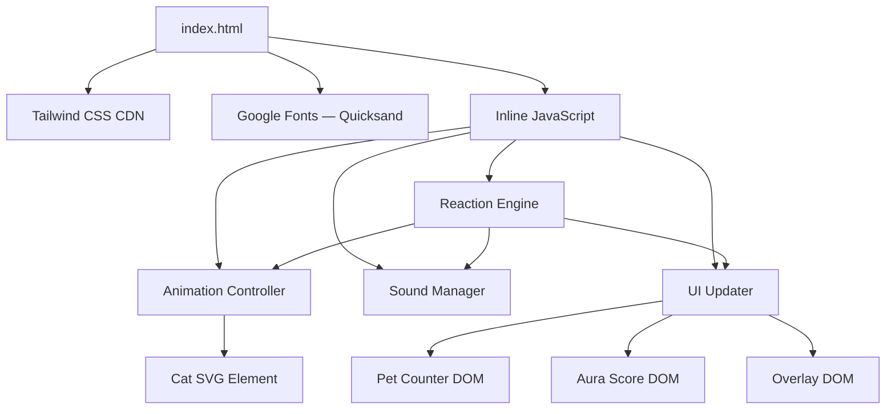
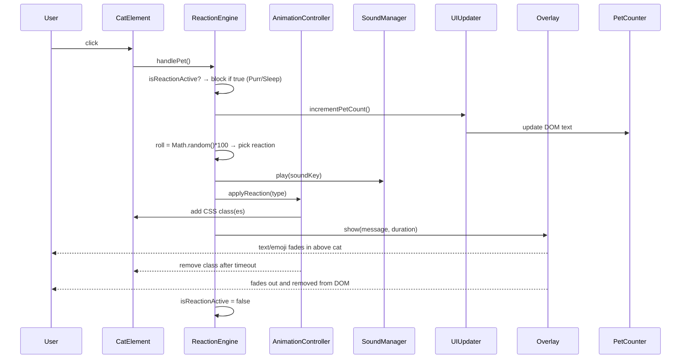
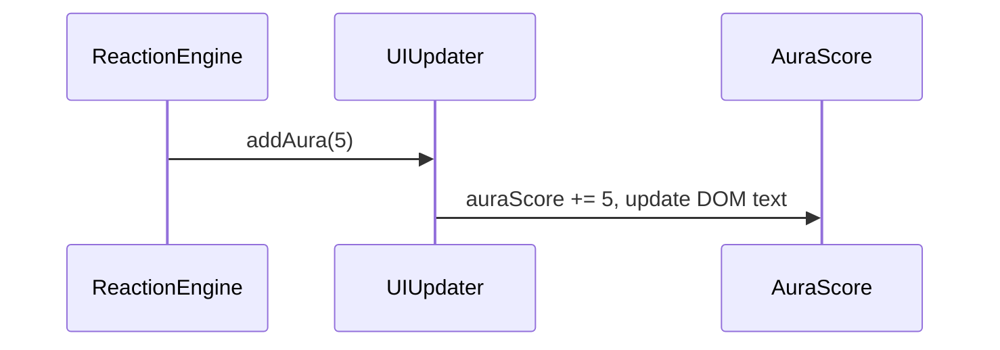

# Design Document: Cat Petting Clicker

## Overview

A single-file, single-page web application (`index.html`) where the user pets a minimalist SVG cat by clicking on it. Each click triggers one of four weighted reactions — Happy (40%), Purring (30%), Sleeping (20%), Zoomies (10%) — each with its own animation, overlay, and optional sound effect. The entire app runs in the browser with no build step, using Tailwind CSS via CDN and Vanilla JavaScript.

The aesthetic is soft glassmorphism: pastel pink-to-cyan gradient background, frosted-glass card container, and the "Quicksand" Google Font for all text. State is ephemeral (session only); no persistence layer is required.

---

## Architecture

The app lives in a single HTML file. All JavaScript is inline `<script>` and all styles come from Tailwind CDN utility classes plus a small `tailwind.config` extension block for custom keyframes.



### Single-File Layout

```
index.html
├── <head>
│   ├── Tailwind CDN <script> with tailwind.config (custom keyframes)
│   ├── Google Fonts <link>
│   └── Inline <style> (glassmorphism, font fallback)
└── <body>
    ├── Background gradient layer
    ├── Glassmorphism card container
    │   ├── Title "🐱 Cat Petter"
    │   ├── Pet Counter display
    │   ├── Aura Score display
    │   ├── Cat element (SVG + click target)
    │   │   └── Overlay container (absolutely positioned above cat)
    │   └── Hint text
    └── Inline <script> (all JS modules)
```

---

## Sequence Diagrams

### Main Pet Interaction Flow



### Aura Score Update (Happy Reaction only)



---

## Components and Interfaces

### Component 1: Reaction Engine

**Purpose**: Selects which reaction fires based on a random roll and orchestrates the other modules. Acts as the central coordinator.

**Interface**:
```javascript
const ReactionEngine = {
  isActive: false,           // true while Purr or Sleep is blocking
  activeTimeout: null,       // current clearTimeout handle

  handlePet() { ... },       // entry point — called on cat click
  selectReaction(roll) { ... }, // maps 1-100 roll → reaction type
  executeReaction(type) { ... } // dispatches to modules
}
```

**Responsibilities**:
- Guard against overlapping Purr/Sleep reactions (block re-clicks)
- For Happy, reset timer if already active (no duplicate class)
- Roll a random integer 1–100 and map to reaction weights:
  - 1–40 → `'happy'`
  - 41–70 → `'purring'`
  - 71–90 → `'sleeping'`
  - 91–100 → `'zoomies'`

---

### Component 2: Animation Controller

**Purpose**: Applies and removes Tailwind CSS animation/transform classes on the cat element. Manages timers for class cleanup.

**Interface**:
```javascript
const AnimationController = {
  catEl: null,               // reference to #cat DOM element
  happyTimer: null,          // timeout handle for happy cleanup

  init(catEl) { ... },
  applyHappy() { ... },      // add animate-bounce, reset if already active
  removeHappy() { ... },     // remove animate-bounce after 1500ms
  applyPurring() { ... },    // add animate-pulse
  removePurring() { ... },   // remove animate-pulse after 2000ms
  applySleeping() { ... },   // add scale-90 rotate-6
  removeSleeping() { ... },  // remove after reaction completes
  applyZoomies() { ... },    // add animate-wiggle within 50ms
  removeZoomies() { ... },   // remove animate-wiggle after 400ms
  clearAll() { ... }         // emergency reset
}
```

**Responsibilities**:
- Never duplicate animation classes; check `classList.contains()` before adding
- Use `setTimeout` for all class removals with the durations specified in requirements
- For Happy: if already bouncing, `clearTimeout(happyTimer)` and restart the 1500ms timer

---

### Component 3: Sound Manager

**Purpose**: Wraps `HTMLAudioElement` creation and playback. Silently handles load/play failures.

**Interface**:
```javascript
const SoundManager = {
  sounds: {},                // { [key]: HTMLAudioElement }

  init() { ... },            // pre-create Audio objects for all sounds
  play(key) { ... }          // restart-from-0 or start playback
}
```

**Sound keys and files**:
| Key | File | Used by |
|-----|------|---------|
| `'pet'` | `sounds/pop.mp3` | All reactions (initial click feedback) |
| `'purr'` | `sounds/purr.mp3` | Purring reaction (loop for 2000ms) |
| `'zoom'` | `sounds/zoom.mp3` | Zoomies reaction (play once) |

**Responsibilities**:
- Wrap all `Audio()` creation and `.play()` calls in `try/catch`
- On `play(key)`: set `currentTime = 0` then call `.play()` — handles both restart and fresh start
- For Purr: set `audio.loop = true` before play, then `setTimeout(() => { audio.pause(); audio.loop = false; }, 2000)`
- If a sound file doesn't exist, the `Audio` error event fires silently (no `console.error` thrown to user)

---

### Component 4: UI Updater

**Purpose**: Owns all direct DOM mutations for counters and scores.

**Interface**:
```javascript
const UIUpdater = {
  petCountEl: null,
  auraScoreEl: null,
  petCount: 0,
  auraScore: 0,

  init(petCountEl, auraScoreEl) { ... },
  incrementPetCount() { ... },  // petCount++, update DOM within 100ms
  addAura(amount) { ... }       // auraScore += amount, update DOM
}
```

**Responsibilities**:
- `petCountEl.textContent = \`Total Pets: \${petCount} 🐈\``
- Display format must have no leading zeros and support counts beyond 999999
- `auraScoreEl.textContent = \`✨ Aura: \${auraScore}\``

---

### Component 5: Overlay

**Purpose**: Creates, animates, and removes short-lived text/emoji elements that appear above the cat.

**Interface**:
```javascript
const Overlay = {
  containerEl: null,         // absolutely-positioned div above cat

  init(containerEl) { ... },
  showText(text, displayMs, fadeMs) { ... },   // general text overlay
  showZzz() { ... },                           // 3 staggered Zzz elements
  showSpeedLines() { ... },                    // 💨 emoji overlay for zoomies
  clearAll() { ... }
}
```

**Responsibilities**:
- `showText`: create `<span>`, fade in immediately, hold for `displayMs`, fade out over `fadeMs`, then `remove()` from DOM
- `showZzz`: create 3 spans with `animate-zzz` class, staggered by 500ms each (0ms, 500ms, 1000ms); all fade out simultaneously after 2000ms over 500ms
- `showSpeedLines`: show 💨 for 1000ms, fade out over 300ms
- All elements appended to `containerEl`, positioned absolutely to appear above cat

---

## Data Models

### AppState

All runtime state lives in module-level variables inside the inline `<script>`. No global object is strictly required, but logically:

```javascript
// Ephemeral session state — no persistence
const state = {
  petCount: 0,       // non-negative integer, displayed in Pet Counter
  auraScore: 0,      // non-negative integer, increases by 5 on Happy
  isBlocked: false   // true during Purring or Sleeping reactions
}
```

### Reaction Type

```javascript
// Reaction type constants
const REACTION = {
  HAPPY:    'happy',    // roll 1-40
  PURRING:  'purring',  // roll 41-70
  SLEEPING: 'sleeping', // roll 71-90
  ZOOMIES:  'zoomies'   // roll 91-100
}
```

### Reaction Config

```javascript
const REACTION_CONFIG = {
  happy:    { animDuration: 1500, overlayText: 'YAY! 😆 (+5 Aura)', aura: 5 },
  purring:  { animDuration: 2000, overlayText: '~ purring ~',        aura: 0 },
  sleeping: { animDuration: 2500, overlayText: null /* Zzz overlay */ },
  zoomies:  { animDuration: 1000, overlayText: null /* speed lines */ }
}
```

---

## Cat Element (SVG Design)

The cat is a pure SVG illustration with ≤10 shape primitives and ≥2 identifiable cat features, rendered entirely in the browser with no external image assets.

```html
<!-- Cat SVG: 8 primitives — body, head, left ear, right ear, left eye, right eye, nose, tail -->
<svg id="cat" viewBox="0 0 100 120" width="160" height="192"
     class="cursor-pointer select-none transition-transform duration-300"
     aria-label="Clickable cat — click to pet!">
  <!-- Body -->
  <ellipse cx="50" cy="85" rx="32" ry="26" fill="#F3C5A0"/>
  <!-- Head -->
  <circle cx="50" cy="52" r="26" fill="#F3C5A0"/>
  <!-- Left ear -->
  <polygon points="28,34 22,14 38,28" fill="#F3C5A0"/>
  <!-- Right ear -->
  <polygon points="72,34 78,14 62,28" fill="#F3C5A0"/>
  <!-- Left eye -->
  <ellipse cx="42" cy="50" rx="4" ry="5" fill="#3D2B1F"/>
  <!-- Right eye -->
  <ellipse cx="58" cy="50" rx="4" ry="5" fill="#3D2B1F"/>
  <!-- Nose -->
  <polygon points="50,56 47,59 53,59" fill="#E8697A"/>
  <!-- Tail -->
  <path d="M80,95 Q100,75 90,65" stroke="#F3C5A0" stroke-width="7"
        fill="none" stroke-linecap="round"/>
</svg>
```

Features present: ears (×2), eyes (×2), nose, tail — 6 identifiable cat features from the allowable list.

---

## Tailwind Configuration (CDN Extension)

Defined in a `<script>` tag **before** the Tailwind CDN `<script src>` tag:

```javascript
tailwind.config = {
  theme: {
    extend: {
      keyframes: {
        wiggle: {
          '0%, 100%': { transform: 'translateX(0)' },
          '25%':       { transform: 'translateX(-10px)' },
          '75%':       { transform: 'translateX(10px)' }
        },
        'zzz-fade': {
          '0%':   { opacity: '0', transform: 'translateY(0)' },
          '100%': { opacity: '1', transform: 'translateY(-20px)' }
        }
      },
      animation: {
        wiggle: 'wiggle 0.4s ease-in-out 1',
        zzz:    'zzz-fade 1s ease-out 1'
      }
    }
  }
}
```

> **Important**: The config script must appear before `<script src="https://cdn.tailwindcss.com">`.

---

## Layout and Glassmorphism

```html
<body class="min-h-screen flex items-center justify-center font-sans"
      style="background: linear-gradient(135deg, #FFDEE9, #B5FFFC);">

  <!-- Glassmorphism card -->
  <div class="backdrop-blur-md bg-white/30 border border-white/40 rounded-3xl
              shadow-xl p-10 flex flex-col items-center gap-6 max-w-xs w-full mx-4">
    <!-- Title -->
    <h1 class="text-2xl font-bold text-pink-600 tracking-wide">🐱 Cat Petter</h1>

    <!-- Pet Counter -->
    <p id="pet-count" class="text-lg font-semibold text-indigo-700">
      Total Pets: 0 🐈
    </p>

    <!-- Aura Score -->
    <p id="aura-score" class="text-base font-medium text-purple-500">
      ✨ Aura: 0
    </p>

    <!-- Cat + Overlay wrapper -->
    <div class="relative flex items-center justify-center">
      <!-- Overlay container: positioned above cat -->
      <div id="overlay-container"
           class="absolute -top-12 left-0 right-0 flex flex-col items-center
                  pointer-events-none z-10">
      </div>

      <!-- Cat SVG (see above) -->
    </div>

    <!-- Hint -->
    <p class="text-sm text-gray-500">Click the cat to pet it!</p>
  </div>
</body>
```

---

## Error Handling

### Sound Failure

**Condition**: `sounds/pop.mp3`, `sounds/purr.mp3`, or `sounds/zoom.mp3` is missing or fails to decode.
**Response**: `try/catch` around `audio.play()`. The `HTMLAudioElement` error event is not re-thrown.
**Recovery**: Reaction continues; Pet Counter increments; animation plays normally.

### Tailwind Config Missing Custom Keyframes

**Condition**: The `tailwind.config` block is missing or malformed.
**Response**: `animate-wiggle` and `animate-zzz` class names will not apply any animation.
**Recovery**: Cat click still works; UI updates correctly; only the custom animations are silently absent.

### Overlapping Reactions (Purr / Sleep)

**Condition**: User clicks cat while Purring or Sleeping reaction is active.
**Response**: `Reaction_Engine.isActive` flag is `true`; the click handler returns early.
**Recovery**: After the blocking reaction's cleanup timeout fires, `isActive` is set to `false` and clicks are re-enabled.

### Happy Double-Click

**Condition**: User clicks cat while Happy bounce is active.
**Response**: `clearTimeout(happyTimer)` and restart the 1500ms cleanup timer. No duplicate `animate-bounce` class added.
**Recovery**: Bounce continues seamlessly; Aura increases by 5 again; overlay resets.

---

## Testing Strategy

### Unit Testing Approach

Manual smoke test in browser; no automated unit test framework is configured by default (single-file app). Key manual test cases:

- Click cat 100 times rapidly — verify counter accuracy and no JS exceptions.
- Trigger each reaction type by temporarily forcing the roll value.
- Verify `isActive` guard: click during Purring/Sleeping → no reaction fires.
- Verify Happy double-click: timer resets, aura increments twice.
- Remove sound files → verify no console errors propagate.

### Property-Based Testing Approach

Property tests are specified here for automated validation if a test harness (e.g., fast-check) is added later.

**Property Test Library**: fast-check (JavaScript)

### Integration Testing Approach

Full browser integration test via manual checklist against each requirement acceptance criterion.

---

## Correctness Properties

*A property is a characteristic or behavior that should hold true across all valid executions of a system — essentially, a formal statement about what the system should do. Properties serve as the bridge between human-readable specifications and machine-verifiable correctness guarantees.*

### Property 1: Pet counter monotonically increases

*For any* sequence of valid pet events, the pet count after N clicks SHALL equal exactly N (starting from 0). The count never decreases and never skips.

**Validates: Requirements 1.3, 6.1, 6.3**

### Property 2: Reaction probabilities are mutually exclusive and exhaustive

*For any* random integer roll in 1–100 (inclusive), the Reaction Engine's `selectReaction` function SHALL return exactly one of `'happy'`, `'purring'`, `'sleeping'`, or `'zoomies'`, and the assignment covers all 100 possible values without overlap or gap.

**Validates: Requirements 1.1, 2.1, 3.2, 4.1, 5.1, 5.6**

### Property 3: Aura score accumulates correctly on Happy

*For any* sequence of pet events, the aura score SHALL equal exactly `5 × (number of Happy reactions triggered)` — it never changes for non-Happy reactions and never decreases.

**Validates: Requirements 2.3**

### Property 4: Blocking guard prevents overlapping Purring/Sleeping reactions

*For any* click event that arrives while `isActive` is `true` (Purring or Sleeping in progress), the reaction engine SHALL NOT increment the pet counter, fire a new reaction, apply new CSS classes, or play a new sound.

**Validates: Requirements 3.6, 4.5**

### Property 5: Happy double-click idempotence on CSS classes

*For any* rapid sequence of clicks that all resolve to the Happy reaction while a bounce is already active, the Cat element SHALL have `animate-bounce` in its `classList` exactly once — not duplicated — and the cleanup timer SHALL be reset to 1500ms from the most recent Happy trigger.

**Validates: Requirements 2.5**

### Property 6: Sound failure does not interrupt reaction or counter

*For any* pet event where the Sound Manager's `play()` call throws or rejects, the Reaction Engine SHALL still execute the reaction, the Animation Controller SHALL still apply the correct CSS class, and the Pet Counter SHALL still increment.

**Validates: Requirements 1.5, 3.4, 8.2**

### Property 7: Custom animation class assignment matches roll ranges exactly

*For any* integer `r` in [1,100]: `animate-bounce` is applied iff `r ∈ [1,40]`; `animate-pulse` iff `r ∈ [41,70]`; `scale-90 rotate-6` iff `r ∈ [71,90]`; `animate-wiggle` iff `r ∈ [91,100]`. No animation class from a different reaction is ever applied for a given roll.

**Validates: Requirements 2.1, 3.2, 4.1, 5.1, 5.6**

### Property 8: Overlay text matches reaction type

*For any* Happy reaction trigger, the overlay SHALL contain the string `"YAY! 😆 (+5 Aura)"`. *For any* Sleeping reaction trigger, exactly three Zzz elements SHALL appear staggered at 0ms, 500ms, and 1000ms. *For any* Zoomies trigger, at least one 💨 element SHALL appear.

**Validates: Requirements 2.2, 4.2, 5.2**

---

## Performance Considerations

- All DOM queries are cached at init time (`document.getElementById`) — no repeated DOM lookups per click.
- `Math.random()` is used for the reaction roll (fast, native).
- `HTMLAudioElement` objects are pre-created at startup, not on each click, to minimize click-to-sound latency.
- Overlay elements are created/destroyed per reaction (cheap for a clicker at human click rates).
- No requestAnimationFrame loops — all transitions use CSS `transition` and `animation` classes, offloaded to the GPU compositor.

## Security Considerations

- No user input is ever set as `innerHTML` — all overlay text is set via `textContent` to prevent XSS.
- No external data fetches beyond Google Fonts CDN and Tailwind CDN; both are read-only static assets.
- Sound file paths are hardcoded constants — no dynamic path construction from user input.

## Dependencies

| Dependency | Version | Purpose | Load method |
|---|---|---|---|
| Tailwind CSS | CDN (latest) | Utility CSS + custom animations | `<script src="https://cdn.tailwindcss.com">` |
| Google Fonts — Quicksand | Latest | Primary typeface | `<link rel="stylesheet" href="https://fonts.googleapis.com/...">` |
| HTML5 Audio API | Browser-native | Sound playback | Built-in |
| SVG | Browser-native | Cat illustration | Inline markup |
